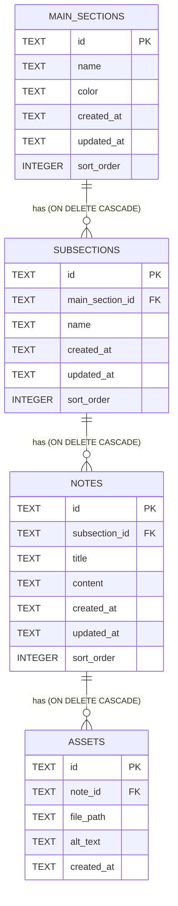
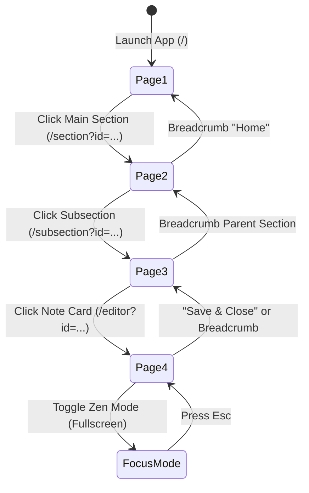

# Study Notes Desktop Application — Master Project Guide & LLM Context

> **Target Audience:** AI Agents, LLMs, and Developers starting a new session on this repository.  
> **Location:** `docs/PROJECT_GUIDE.md`  
> **Last Updated:** 2026-09-24  
> **Version:** 0.2.0

---

## Table of Contents

1. [Project Overview & Core Pillars](#1-project-overview--core-pillars)
2. [Technology Stack & System Architecture](#2-technology-stack--system-architecture)
3. [Repository Directory & File Structure](#3-repository-directory--file-structure)
4. [Data Model & Database Architecture](#4-data-model--database-architecture)
5. [Tauri IPC Backend API (Rust Commands)](#5-tauri-ipc-backend-api-rust-commands)
6. [Frontend Architecture & Design System](#6-frontend-architecture--design-system)
7. [Core Pages & Application Flow](#7-core-pages--application-flow)
8. [Key Features & Implementation Details](#8-key-features--implementation-details)
9. [Development, Testing & Verification Commands](#9-development-testing--verification-commands)
10. [Critical Guidelines & Gotchas for LLMs](#10-critical-guidelines--gotchas-for-llms)

---

## 1. Project Overview & Core Pillars

The **Study Notes Desktop Application** is a Linux-first, 100% offline desktop application designed for programmers, students, and technical learners to organize, edit, and review hierarchical study material without cloud dependencies or feature bloat.

### 1.1 Non-Negotiable Pillars

| Pillar | Policy / Implementation |
|---|---|
| **Platform** | Desktop-only (Target: Linux, optimized for Arch Linux). |
| **Zero Runtime Network (FR-11)** | **100% Offline**. The application must **NEVER** make outbound HTTP/WebSocket/fetch calls, load remote CDN scripts/styles, or load external images over the network. Guarded by `scripts/check-no-network.sh` (`pnpm check:offline`). |
| **Strict 4-Level Hierarchy** | `MainSection` → `Subsection` → `Note` → `Asset` (Images/Files). |
| **Rust Data Layer Isolation** | All SQLite access and filesystem mutations live exclusively in Rust (`src-tauri/src/db/`) via `rusqlite`. No Node.js / frontend SQLite drivers. |
| **Database-Level Integrity** | SQLite `ON DELETE CASCADE` foreign keys and Write-Ahead Logging (WAL) enforce cascade integrity and atomic durability. |
| **XDG Data Storage** | User database and asset files live in the standard XDG data directory: `~/.local/share/study-notes/study-notes.db` and `~/.local/share/study-notes/assets/`. |
| **No Auth / No Cloud Sync** | No accounts, no telemetry, no tracking, no backend server. Data ownership is 100% local to the user's disk. |

---

## 2. Technology Stack & System Architecture

```mermaid
graph TD
    subgraph Frontend [Next.js App Router Static Export]
        UI[React 19 Components]
        State[Custom React Hooks]
        Renderer[Dependency-Free Markdown & Syntax Engine]
        Tailwind[Tailwind CSS v4 Terminal Noir]
    end

    subgraph IPC [Tauri 2.0 IPC Bridge]
        Invoke[@tauri-apps/api/core: invoke]
    end

    subgraph Backend [Rust Core]
        Cmds[Tauri Command Handlers]
        Rusqlite[rusqlite Connection + WAL + FTS5]
        FS[Filesystem Asset Storage]
    end

    subgraph Storage [XDG Base Dir: ~/.local/share/study-notes/]
        DB[(study-notes.db)]
        AssetsDir[assets/ UUID files]
    end

    UI --> State
    State --> Invoke
    Invoke --> Cmds
    Cmds --> Rusqlite
    Cmds --> FS
    Rusqlite --> DB
    FS --> AssetsDir
```

### 2.1 Backend Stack
- **Framework:** [Tauri v2](https://v2.tauri.app/) (`tauri = "2.11.3"`, `@tauri-apps/cli = "2.11.4"`, `@tauri-apps/api = "2.11.1"`)
- **Language:** Rust (Edition 2021, MSRV 1.77.2+)
- **Database:** SQLite 3 with `rusqlite = { version = "0.40.2", features = ["bundled"] }`
- **Utilities:** `dirs = "6.0.0"` (XDG path resolution), `uuid = { version = "1.20.0", features = ["v4"] }`, `chrono = "0.4.45"`, `serde` / `serde_json`.

### 2.2 Frontend Stack
- **Framework:** Next.js 16.3.4 (App Router) configured with `output: 'export'` for purely static HTML/CSS/JS generation.
- **UI Library:** React 19.2.8 / React DOM 19.2.8.
- **Styling:** Tailwind CSS v4 (`@tailwindcss/postcss: ^4`, `tailwindcss: ^4`) with inline CSS custom properties.
- **Markdown & Code Highlighting:** Custom zero-dependency regex tokenizer supporting JS, TS, Rust, Python, and SQL syntax coloring with sanitization against XSS.

---

## 3. Repository Directory & File Structure

```
study-notes/
├── .github/                      # GitHub Actions workflows & CI configs
├── AGENTS.md                     # Agent specific instructions (Next.js rule block)
├── CLAUDE.md                     # Quick agent instructions
├── DESIGN.md                     # Complete Design System ("Terminal Noir" specification)
├── Main-plan.md                  # Master roadmap and phase milestone definitions
├── PRD.md                        # Product Requirements Document
├── README.md                     # User-facing README with setup & backup guides
├── package.json                  # Frontend dependencies and npm scripts
├── pnpm-lock.yaml                # pnpm lockfile
├── next.config.ts                # Next.js configuration (static export, unoptimized images)
├── tsconfig.json                 # TypeScript strict compiler options
│
├── app/                          # Next.js App Router (4 Top-Level Pages)
│   ├── favicon.ico               # Application favicon
│   ├── globals.css               # Terminal Noir theme tokens, Tailwind v4 theme, print styles
│   ├── layout.tsx                # Root layout with font definitions and metadata
│   ├── page.tsx                  # Page 1: Main Sections Directory (Home Dashboard)
│   ├── section/
│   │   └── page.tsx              # Page 2: Subsections List (/section?id=[mainSectionId])
│   ├── subsection/
│   │   └── page.tsx              # Page 3: Notes List (/subsection?id=[subsectionId])
│   └── editor/
│       └── page.tsx              # Page 4: Note Editor & Focus Mode (/editor?id=[noteId])
│
├── components/                   # Modular React UI Components
│   ├── common/                   # Shared primitive components
│   │   ├── Badge.tsx             # Semantic badge component
│   │   ├── Button.tsx            # Standard buttons (primary, secondary, ghost, danger)
│   │   ├── CascadeDeleteDialog.tsx # Generic cascade deletion confirmation modal
│   │   ├── Dialog.tsx            # Accessible modal dialog primitive (Esc key, backdrop)
│   │   ├── DragHandle.tsx        # Grip icon affordance for drag-and-drop reordering
│   │   ├── Icons.tsx             # 100% offline inline SVG icons (Zero CDN fonts)
│   │   ├── Input.tsx             # Styled input and textarea elements
│   │   ├── IntegrityStatusBanner.tsx # SQLite PRAGMA integrity warning banner
│   │   ├── KeyboardShortcutBadge.tsx # Visual Kbd badge representation
│   │   ├── ReorderableList.tsx   # Reusable list with drag-and-drop reordering logic
│   │   └── ThemeToggle.tsx       # Dark/Light/System theme toggle dropdown
│   ├── editor/                   # Page 4 Editor components
│   │   ├── AssetManagerModal.tsx # Note attachment manager (upload, view, delete assets)
│   │   ├── EditorHeader.tsx      # Editor topbar (breadcrumbs, autosave pill, view toggles)
│   │   ├── EditorToolbar.tsx     # Markdown formatting bar (H1-H3, bold, italic, code, etc.)
│   │   ├── FocusModeView.tsx     # Distraction-free Zen full-screen reading mode
│   │   ├── MarkdownEditor.tsx    # Raw textarea editor with line numbers, indent handling
│   │   ├── MarkdownPreview.tsx   # HTML preview pane with copy buttons and asset data-URLs
│   │   └── NoteInspector.tsx     # Right-side drawer for live Table of Contents & asset gallery
│   ├── layout/                   # Core application frame
│   ├── layout/AppHeader.tsx      # Top bar with breadcrumbs, status pill, search trigger
│   └── layout/AppSidebar.tsx     # Navigation sidebar with tree view, section links, storage card
│   ├── notes/                    # Page 3 Notes components
│   │   ├── CreateNoteModal.tsx   # Modal for creating new notes
│   │   ├── DeleteNoteDialog.tsx  # Cascade deletion confirmation for notes
│   │   ├── EditNoteTitleModal.tsx# Modal for renaming note titles
│   │   ├── NoteCard.tsx          # Card rendering note preview, update time, and actions
│   │   ├── NoteHeader.tsx        # Subsection header hero with breadcrumbs and counts
│   │   ├── NoteList.tsx          # Grid/List view container for notes with empty states
│   │   └── NoteToolbar.tsx       # Search and sorting toolbar for notes
│   ├── search/                   # Global Search & Command Palette
│   │   ├── CommandPalette.tsx    # ⌘K modal with FTS5 search, scope filtering, keyboard nav
│   │   ├── HighlightedText.tsx   # Substring match highlighter for search results
│   │   ├── SearchResultItem.tsx  # Result item card showing title, snippet, and category
│   │   └── SearchScopeFilter.tsx # Filter pills (All, Sections, Subsections, Notes)
│   ├── sections/                 # Page 1 Main Sections components
│   │   ├── ColorPicker.tsx       # 12-preset color swatch selector with custom hex preview
│   │   ├── CreateSectionModal.tsx# Modal for creating main sections
│   │   ├── DeleteSectionDialog.tsx# Deletion confirmation with live cascade counters
│   │   ├── EditSectionModal.tsx  # Modal for editing name & color of a section
│   │   ├── SectionCard.tsx       # Grid card for main section with counts and actions
│   │   ├── SectionFilterBar.tsx  # Search input, view toggle (grid/list), and sort menu
│   │   ├── SectionGrid.tsx       # Container for rendering sections with skeleton loading
│   │   └── SectionListRow.tsx    # Compact table/row representation of a main section
│   └── subsections/              # Page 2 Subsections components
│       ├── CreateSubsectionModal.tsx # Modal for adding a subsection
│       ├── DeleteSubsectionDialog.tsx # Deletion confirmation with live note counts
│       ├── EditSubsectionModal.tsx   # Modal for renaming a subsection
│       ├── SubsectionCard.tsx        # Subsection card with recent note preview tiles
│       ├── SubsectionHero.tsx        # Header showing parent section metadata & stats
│       ├── SubsectionList.tsx        # List/Grid container for subsections
│       └── SubsectionToolbar.tsx     # Search and detailed/compact view toggle
│
├── lib/                          # Application Logic, Hooks, APIs, Utilities
│   ├── api/                      # Typed wrappers around Tauri IPC `invoke` calls
│   │   ├── assets.ts             # Asset management API (list, attach, delete, data-URL)
│   │   ├── notes.ts              # Notes API (CRUD, get_note, get_note_context, cascade)
│   │   ├── reorder.ts            # Entity reordering API
│   │   ├── search.ts             # Full-text search API
│   │   ├── sections.ts           # Main sections API
│   │   ├── subsections.ts        # Subsections API
│   │   ├── system.ts             # DB integrity check and data directory path API
│   │   └── types.ts              # TypeScript interface definitions for all data structures
│   ├── hooks/                    # Reusable React hooks
│   │   ├── useAutoSave.ts        # 1200ms debounced autosave engine with Ctrl+S / flush support
│   │   ├── useCommandPalette.ts  # Global shortcut listener (⌘K / Ctrl+K) and search state
│   │   ├── useDebounce.ts        # Generic value debouncing hook
│   │   ├── useDeferredRender.ts  # Virtualization/deferred rendering for long lists
│   │   ├── useDragReorder.ts     # Drag-and-drop reordering state and optimistic sync
│   │   ├── useMainSections.ts    # Main sections state with optimistic mutations
│   │   ├── useNoteEditor.ts      # Active note draft state, dirty checking, and asset binder
│   │   ├── useNotes.ts           # Notes state scoped to subsection with search filter
│   │   ├── usePrintExport.ts     # Triggers window.print() for PDF generation
│   │   ├── useSubsections.ts     # Subsections state scoped to main section
│   │   ├── useTableOfContents.ts # Heading extractor for editor Table of Contents
│   │   └── useTheme.ts           # Theme provider (dark/light/system) with local storage sync
│   └── utils/                    # Pure utility functions
│       ├── assetPath.ts          # Local asset data URL converter and memory cache
│       ├── format.ts             # Relative time formatter ("2 hours ago", "Yesterday")
│       ├── markdownRenderer.ts   # Safe Markdown-to-HTML parser with syntax highlighter
│       └── performance.ts        # Micro-benchmarking and performance measurement utilities
│
├── packaging/                    # Distribution and packaging assets
│   ├── aur/                      # Arch Linux AUR package files (PKGBUILD, .SRCINFO)
│   └── linux/                    # Linux desktop entries and icons
│       ├── study-notes.desktop   # XDG Desktop entry file
│       └── icons/                # High-res SVG and PNG app icons
│
├── plans/                        # Detailed Phase Implementation Specifications (Phases 1-9)
│   ├── phase-1-data-layer.md
│   ├── phase-2-main-sections.md
│   ├── phase-3-subsections.md
│   ├── phase-4-notes-list.md
│   ├── phase-5-note-editor.md
│   ├── phase-6-theming-performance-integrity.md
│   ├── phase-7-reordering-and-search.md
│   ├── phase-8-packaging-and-distribution.md
│   └── phase-9-pdf-export.md
│
├── docs/                         # Developer documentation & LLM handover guides
│   ├── AGENT_HANDOVER.md         # Original agent handover document
│   └── PROJECT_GUIDE.md          # This comprehensive guide
│
├── scripts/                      # Utility and automation scripts
│   ├── backup-data.sh            # Creates timestamped tarball of ~/.local/share/study-notes
│   ├── check-no-network.sh       # Offline verification script (guards against network calls)
│   ├── restore-data.sh           # Restores data directory from a backup tarball
│   └── seed-benchmark-data.sh    # Seeds database with 1,000+ notes for scale testing
│
└── src-tauri/                    # Rust Backend (Tauri v2 Application)
    ├── Cargo.toml                # Rust dependencies & metadata
    ├── build.rs                  # Tauri build hook
    ├── tauri.conf.json           # Tauri v2 security, window, and build settings
    └── src/
        ├── lib.rs                # Application initialization, plugin setup & command registry
        ├── main.rs               # Binary entry point
        └── db/                   # Database subsystem
            ├── mod.rs            # SQLite connection setup, WAL mode, path resolution
            ├── migration.rs      # Versioned migration engine (runs embedded SQL files)
            ├── schema.rs         # Table and index SQL string constants (checked reference)
            ├── models.rs         # Rust serde-serializable entity structs
            ├── commands.rs       # 25 Tauri `#[tauri::command]` handlers + internal helpers
            ├── tests.rs          # 34 comprehensive in-memory unit and integration tests
            └── migrations/       # Embedded SQL migrations
                ├── 001_initial_schema.sql       # Initial DDL (tables, foreign keys, cascades)
                ├── 002_performance_indexes.sql # B-Tree indexes on foreign keys & sort orders
                └── 003_full_text_search.sql    # FTS5 virtual table + auto-sync triggers
```

---

## 4. Data Model & Database Architecture

### 4.1 Relational Schema



### 4.2 SQLite Pragmas & Guarantees
- **WAL Mode:** `PRAGMA journal_mode = WAL;` (Enables concurrent reads during writes, avoids lock starvation, ensures crash resistance).
- **Foreign Key Enforcement:** `PRAGMA foreign_keys = ON;` (Ensures cascade deletion and constraint safety).
- **Synchronous Writes:** `PRAGMA synchronous = NORMAL;`
- **Transactions:** Write operations use `BEGIN IMMEDIATE` / `COMMIT` transactions to prevent dirty writes or partial updates.

### 4.3 Full-Text Search (FTS5)
Migration `003_full_text_search.sql` sets up an SQLite **FTS5 external content table** (`notes_fts`) using the Porter stemmer and `unicode61` tokenizer. Three SQLite triggers (`AFTER INSERT`, `AFTER UPDATE`, `AFTER DELETE` on `notes`) keep the search index automatically in sync within the same transaction. Search queries execute ranked BM25 queries with snippet extraction.

---

## 5. Tauri IPC Backend API (Rust Commands)

All 25 backend commands are implemented in `src-tauri/src/db/commands.rs` and registered in `src-tauri/src/lib.rs`.

| Command Name | Parameters | Return Type | Description |
|---|---|---|---|
| **Main Sections** | | | |
| `list_main_sections` | *none* | `Vec<MainSection>` | Returns all main sections ordered by `sort_order ASC, created_at ASC`. |
| `create_main_section` | `name: String, color: String` | `MainSection` | Creates a new main section with UUID id. |
| `update_main_section` | `id: String, name: String, color: String` | `MainSection` | Updates name and color of an existing section. |
| `delete_main_section` | `id: String` | `()` | Deletes section, cascading to all subsections, notes, and disk assets. |
| `get_main_section_cascade_info` | `id: String` | `MainSectionCascadeInfo` | Returns count of child subsections, notes, and assets for confirmation dialogs. |
| **Subsections** | | | |
| `list_subsections` | `main_section_id: String` | `Vec<Subsection>` | Returns all subsections for a main section ordered by `sort_order ASC`. |
| `create_subsection` | `main_section_id: String, name: String` | `Subsection` | Creates a new subsection under the specified parent. |
| `update_subsection` | `id: String, name: String` | `Subsection` | Renames a subsection. |
| `delete_subsection` | `id: String` | `()` | Deletes subsection, cascading to child notes and disk assets. |
| `get_subsection_cascade_info` | `id: String` | `SubsectionCascadeInfo` | Returns child note and asset counts for deletion warnings. |
| **Notes** | | | |
| `list_notes` | `subsection_id: String` | `Vec<Note>` | Returns all notes under a subsection ordered by `sort_order ASC, updated_at DESC`. |
| `get_note` | `id: String` | `Option<Note>` | Retrieves a single note by ID. |
| `get_note_context` | `id: String` | `Option<NoteContextHierarchy>` | Fetches note along with parent subsection name, main section name, and section color. |
| `create_note` | `subsection_id: String, title: String` | `Note` | Creates a blank note with the given title. |
| `update_note` | `id: String, title: String, content: String` | `Note` | Saves new title and content, updating `updated_at`. |
| `delete_note` | `id: String` | `()` | Deletes note and purges its attached asset files from disk. |
| `get_note_cascade_info` | `id: String` | `NoteCascadeInfo` | Returns attached asset count for deletion dialog. |
| **Assets** | | | |
| `list_assets` | `note_id: String` | `Vec<Asset>` | Lists all assets attached to a note. |
| `attach_note_asset` | `note_id: String, file_name: String, file_bytes: Vec<u8>, alt_text: String` | `Asset` | Writes bytes to `~/.local/share/study-notes/assets/[uuid].[ext]` and inserts DB row. |
| `delete_asset` | `id: String` | `()` | Deletes DB row and removes file from disk. |
| `read_asset_data_url` | `file_path: String` | `String` | Reads managed asset from disk, validates against traversal, returns `data:[mime];base64,[data]`. |
| **Search & Organization** | | | |
| `search_notes` | `query: String, subsection_id: Option<String>` | `Vec<SearchResult>` | Performs FTS5 BM25 ranked search across note titles and content. |
| `reorder_entities` | `entity_type: String, items: Vec<ReorderItem>` | `()` | Batch updates `sort_order` values inside an atomic transaction. |
| **System & Health** | | | |
| `check_db_integrity` | *none* | `DbIntegrityReport` | Executes `PRAGMA quick_check` and `PRAGMA foreign_key_check`. |
| `get_data_dir` | *none* | `String` | Returns absolute path to `~/.local/share/study-notes`. |

---

## 6. Frontend Architecture & Design System

### 6.1 "Terminal Noir" Design Tokens
Configured in `app/globals.css` using Tailwind CSS v4 `@theme inline`:

- **Background Surfaces:**
  - Base Canvas: `#0b141c` (`bg-background` / `bg-surface`)
  - Low Container (Sidebars, Cards): `#141c24` (`bg-surface-container-low`)
  - Standard Container: `#182028` (`bg-surface-container`)
  - Active / Hover Container: `#222b33` (`bg-surface-container-high`)
  - Highest / Overlays: `#2d363e` (`bg-surface-container-highest`)
- **Hairline Borders:** Solid 1px `#30363d` (`border-outline-variant`). Drop shadows are avoided in favor of crisp borders.
- **Semantic Accents:**
  - Cobalt (`#388bfd` / `#aac7ff`): Primary buttons, focused inputs, selection states.
  - Emerald (`#3fb950` / `#67df70`): Success badges, saved status indicators.
  - Amber (`#d29922`): Unsaved changes, pending warning indicators.
  - Rose (`#f85149` / `#ffb4ab`): Destructive actions, delete confirmation dialogs.
  - Violet (`#a371f7` / `#d5bbff`): Category tags and badge highlights.

### 6.2 Typography & Offline Fonts
- **Prose & UI:** **Inter** (Bundled locally at build time via `next/font/google`).
- **Code & Numbers:** **JetBrains Mono** (`font-mono`).
- **Icons:** **100% Inline SVG** components defined in `components/common/Icons.tsx`. No runtime font requests to Google Fonts or CDN servers.

---

## 7. Core Pages & Application Flow

The application follows a strictly structured 4-page navigation depth:



### Page Breakdown:
1. **Page 1: Main Sections (`/`)**
   - Grid or List view of top-level domains (e.g. "Rust", "Frontend", "Distributed Systems").
   - Filter bar with live name search and sort menu (Last Updated, Name A-Z, Created Date).
   - Create/Edit/Delete modals with real-time cascade count warnings.
   - Drag handle for custom reordering.

2. **Page 2: Subsections (`/section?id=[mainSectionId]`)**
   - Hero header with parent color theme, description, and stats pills.
   - Detailed view (shows recent note preview cards) vs. Compact row view.
   - Quick-add note dialog directly from the subsection card.
   - Cascade delete confirmation showing child note counts.

3. **Page 3: Notes List (`/subsection?id=[subsectionId]`)**
   - List of all notes belonging to the selected subsection.
   - Search filter bar scoped to the current subsection.
   - Note cards showing title, last-modified relative timestamp, and preview text snippet.
   - Create Note button and rename/delete context menus.

4. **Page 4: Note Editor (`/editor?id=[noteId]`)**
   - 3 Editor Modes: **Split View** (Editor + Live Preview), **Edit Only**, **Preview Only**.
   - Sticky formatting toolbar (Headings H1-H3, Bold, Italic, Strikethrough, Code block language picker, Inline code, Lists, Blockquotes, Links, Image Attachments).
   - Auto-save engine (debounced 1200ms) with visual "Saved" / "Saving..." / "Unsaved" state indicators.
   - Right Drawer Inspector: Live Table of Contents outline (clickable jump anchors) + Media Gallery.
   - **Focus / Zen Mode:** Distraction-free full-screen reading canvas with customizable column width (Narrow/Standard/Wide) and font sizing.
   - **Print / PDF Export:** Dedicated print stylesheets for exporting notes to PDF.

---

## 8. Key Features & Implementation Details

### 8.1 ⌘K Command Palette & FTS5 Search
- Pressing `⌘K` or `Ctrl+K` opens the global search modal (`components/search/CommandPalette.tsx`).
- Searches across all note titles and content simultaneously using SQLite FTS5 BM25 ranking.
- Supports search scope filters (`All`, `Sections`, `Subsections`, `Notes`).
- Keyboard navigation (Up/Down arrow keys to highlight, Enter to open directly in the editor).
- Highlights matched search terms using `HighlightedText.tsx`.

### 8.2 Markdown & Code Highlighting Engine
- Implemented in `lib/utils/markdownRenderer.ts` with **zero runtime NPM dependencies**.
- Tokenizes code blocks with regex-based syntax highlighters for JavaScript, TypeScript, Rust, Python, and SQL.
- Automatically escapes raw HTML tags in markdown content to prevent XSS.
- Line number gutter support and auto-closing pairs (brackets, quotes, backticks) in `MarkdownEditor.tsx`.

### 8.3 Local Asset Management & Offline Data URLs
- Images attached by the user are sent as byte arrays to Rust (`attach_note_asset`).
- Rust generates a UUID filename and writes the file into `~/.local/share/study-notes/assets/`.
- The frontend retrieves the asset via `read_asset_data_url`, which checks against directory traversal attacks and returns a base64 `data:` URI.
- Results are cached in memory by `lib/utils/assetPath.ts` to ensure fast rendering.

### 8.4 Drag-and-Drop Entity Reordering
- Managed by `lib/hooks/useDragReorder.ts` and `components/common/ReorderableList.tsx`.
- Provides instant optimistic UI updates on drop, followed by an asynchronous call to the Rust command `reorder_entities`.

### 8.5 Database Integrity & Diagnostics
- `check_db_integrity` runs `PRAGMA quick_check` and `PRAGMA foreign_key_check` on app startup.
- If an issue is detected, `IntegrityStatusBanner.tsx` displays a non-intrusive warning with troubleshooting steps.

---

## 9. Development, Testing & Verification Commands

All quality gates must pass before submitting code changes:

```bash
# 1. Start Next.js frontend development server
pnpm dev

# 2. Run Tauri desktop app in development mode
pnpm tauri dev

# 3. Build Next.js static export (verifies build & outputs to ./out)
pnpm build

# 4. Run ESLint code checks
pnpm lint

# 5. Verify 100% Offline / Zero Outbound Network Calls (Mandatory check)
pnpm check:offline

# 6. Run Rust backend unit & integration tests (34 tests)
~/.rustup/toolchains/stable-x86_64-unknown-linux-gnu/bin/cargo test --manifest-path src-tauri/Cargo.toml

# 7. Run Rust Clippy linter (Zero warnings policy)
~/.rustup/toolchains/stable-x86_64-unknown-linux-gnu/bin/cargo clippy --manifest-path src-tauri/Cargo.toml -- -D warnings

# 8. Create a manual backup of the local database
bash scripts/backup-data.sh

# 9. Restore database from a backup
bash scripts/restore-data.sh ~/.local/share/study-notes-backups/backup_[timestamp].tar.gz

# 10. Seed database with benchmark notes (for performance testing)
bash scripts/seed-benchmark-data.sh
```

---

## 10. Critical Guidelines & Gotchas for LLMs

When developing in this repository, always abide by these established patterns:

1. **No External Network Calls:**  
   Never import external scripts, CDNs, telemetry tools, or make `fetch()` calls to remote URLs. Any network call violates FR-11 and will fail `pnpm check:offline`.
2. **Next.js Static Export & `useSearchParams`:**  
   Because the frontend is statically exported (`output: 'export'`), any page using `useSearchParams()` (such as `/section`, `/subsection`, `/editor`) **must wrap the component tree in `<Suspense>`**.
3. **React Hooks State In Effect Rule:**  
   ESLint strictly forbids synchronous `setState` within `useEffect`. Use either:
   - Async promises (`.then(data => if (mounted) setState(data))`), or
   - ID-tagged derived snapshot state (e.g. `isLoading = snapshot === null || snapshot.mainSectionId !== mainSectionId`).
4. **Tailwind v4 Spacing Collision Caution:**  
   Do **not** use `max-w-sm`, `max-w-md`, `max-w-lg`, `max-w-xl`, or `max-w-2xl` as custom theme tokens shadow Tailwind's defaults. Instead, use explicit arbitrary values like `max-w-[28rem]`, `max-w-[32rem]`, `max-w-[42rem]`.
5. **Rust Asset Storage Architecture:**  
   `attach_note_asset` accepts raw file bytes (`Vec<u8>`) from the HTML file input rather than file paths, because WebKitGTK in Tauri Linux does not expose full local file paths to the webview sandbox.
6. **Rust Toolchain Path:**  
   In sandboxed agent environments where the `cargo` PATH wrapper may fail with a proxy error, call the toolchain binary directly:  
   `~/.rustup/toolchains/stable-x86_64-unknown-linux-gnu/bin/cargo`.
7. **Cascade Deletions & Confirmations:**  
   Whenever implementing deletion UI, always query the corresponding `get_*_cascade_info` Tauri command and display exact counts of child items that will be deleted.
