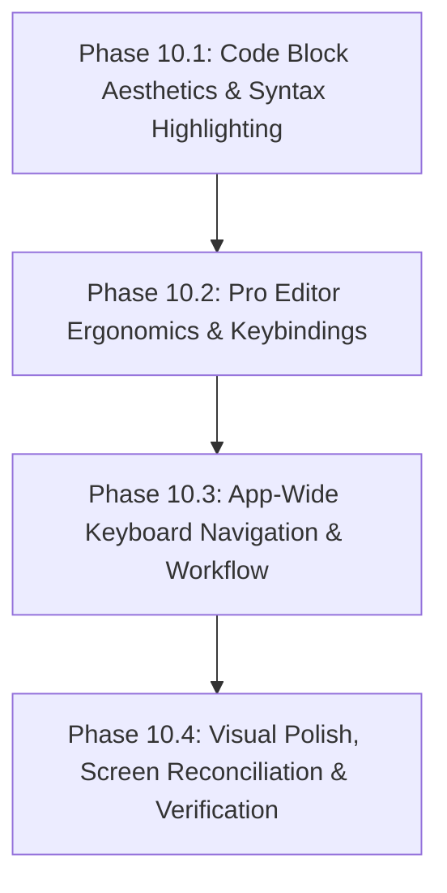

# Phase 10: UX Redesign, Pro Editor Ergonomics & Keyboard Workflow

**Status:** Planned  
**Target:** Desktop App UI, Markdown Editor, Code Block Renderer, Keyboard Navigation, Workflow Redesign  
**Pillars Enforced:** 100% Offline (FR-11), Zero Runtime Network, Strict 4-Level Hierarchy, Arch Linux Platform Fit  

---

## 1. Executive Summary & Goals

This plan outlines an exhaustive redesign of the user workflow and user experience (UX) to transform the Study Notes desktop app into an ultra-fast, keyboard-first, distraction-free technical study environment.

### Core Objectives
1. **Ultra-Readable Code Blocks:** Match the high-contrast "Terminal Noir" terminal window aesthetics in `screens/note_editor_lexical_environment`, complete with control dots, language/file headers, line numbering gutters, copy feedback, and zero-dependency offline syntax highlighting.
2. **Pro-Tier Editor Ergonomics:** Provide an editing experience comparable to VS Code / Obsidian with line movement, line duplication, line deletion, heading toggles, auto-closing bracket pairs, smart list and checklist continuation, and synchronized split-pane scrolling.
3. **Keyboard-First Workflow:** Full mouse-free navigation across all 4 pages using Vim/IDE single-key shortcuts (`j`/`k`, `Enter`, `Backspace`, `n`, `/`), a global keyboard cheatsheet modal (`?`), and transient toast notifications.
4. **Visual & Behavioral Alignment:** Reconcile exact visual and functional elements from all 5 reference screens (`all_sections_devnotes`, `javascript_subsections_devnotes`, `subsection_notes_closures`, `note_editor_lexical_environment`, `full_screen_focus_mode`).

---

## 2. Phased Architecture & Execution Roadmap

---

## Phase 10.1: Code Block Aesthetics & Syntax Highlighting

### 1. Terminal Window Header Container
- **Visual Styling:**
  - Container background set to deep noir `#060f16` (`bg-surface-container-lowest`).
  - Solid 1px border `#30363d` (`border-outline-variant`), rounded corners (`rounded-xl`), and subtle elevation.
- **Top Header Bar:**
  - Surface color `#182028` (`bg-surface-container`) with bottom hairline border.
  - Three macOS/Terminal indicator dots on left: Red (`bg-error/60`), Amber (`bg-amber-500/60`), Emerald (`bg-secondary/60`).
  - Filename / language badge display: shows language name (e.g. `TypeScript`, `Rust`, `SQL`) or extracted file name with language icon.
  - Interactive "Copy" button on right:
    - Default state: copy icon + "Copy" text.
    - Clicked state: checkmark icon + "Copied!" text with emerald badge highlight.
    - Automatic reset after 2000ms.
    - Safe clipboard copy using native API with fallback textarea element for WebKitGTK compatibility.

### 2. Line Numbering Gutter & Code Presentation
- **Gutter Column:**
  - Left-aligned monospace gutter (`font-mono`, `text-xs`) with dimmed numbers (`01`, `02`, `03`...).
  - Right-aligned padding, vertical divider line, non-selectable (`select-none`), 40% opacity.
- **Code Body:**
  - Monospace font (`font-mono`, `JetBrains Mono`), 13px size, 20px line height (`leading-5`).
  - Horizontal scrolling enabled for long lines without wrapping code arbitrarily.
  - Native text selection styling using primary accent (`selection:bg-primary-container selection:text-on-primary`).

### 3. Zero-Dependency Offline Syntax Highlighters
- **Engine Rules (`lib/utils/markdownRenderer.ts`):**
  - Highlighting must remain 100% offline with zero external NPM packages using sticky-regex tokenization.
  - Strict HTML escaping of all code content prior to token replacement to prevent XSS vulnerabilities.
- **Supported Language Tokenizers:**
  - **TypeScript / JavaScript:** Keywords, types, string literals (including template strings), numbers, function names, punctuation, comments (single and multi-line).
  - **Rust:** Keywords, lifetimes, attributes (`#[derive(...)]`), macros (`println!`, `vec!`), types, traits, numeric literals with suffixes.
  - **Python:** Keywords, decorators (`@property`), docstrings, f-strings, special variables (`self`, `cls`), comments.
  - **Go:** Keywords (`func`, `goroutine`, `chan`, `defer`), built-in types, comments, string literals.
  - **Shell / Bash:** Commands, flags (`-f`, `--all`), environment variables (`$HOME`, `${VAR}`), comments, quoted strings.
  - **SQL:** DDL/DML keywords (`SELECT`, `INSERT`, `CREATE`, `JOIN`), data types, strings, comments.
  - **JSON & YAML:** Property keys, string values, numbers, booleans, null values.
- **Color Token Mapping (Terminal Noir):**
  - Keywords: Rose (`#f85149` / `#ffb4ab`)
  - Strings: Emerald (`#3fb950` / `#67df70`)
  - Numbers: Amber (`#d29922` / `#e3b341`)
  - Functions / Identifiers: Cobalt (`#388bfd` / `#aac7ff`)
  - Types / Lifetimes: Violet (`#a371f7` / `#d5bbff`)
  - Comments: Muted gray italic (`#8b919f`)
  - Punctuation / Operators: Neutral text (`#dae3ee`)

### 4. Rich Markdown Callouts (GitHub / Obsidian Style)
- **Syntax Recognized:**
  - `> [!NOTE]`, `> [!TIP]`, `> [!WARNING]`, `> [!IMPORTANT]`, `> [!CAUTION]`.
- **Rendered Output:**
  - Rounded container (`rounded-xl`) with 4px solid colored left accent border.
  - Integrated header with semantic icon, title label, and category pill.
  - Color themes:
    - **Note:** Cobalt accent (`#388bfd`), `#0e1a26` container, `info` icon.
    - **Tip:** Emerald accent (`#3fb950`), `#0e2214` container, `lightbulb` icon.
    - **Warning:** Amber accent (`#d29922`), `#221c10` container, `warning` icon.
    - **Important:** Violet accent (`#a371f7`), `#1e132c` container, `priority_high` icon.
    - **Caution:** Rose accent (`#f85149`), `#2a1214` container, `report` icon.

### 5. Interactive GFM Checklists & Heading Anchors
- **Task Lists:**
  - Support `- [ ]` (uncompleted) and `- [x]` (completed) markdown syntax.
  - Render as custom styled checkboxes (`accent-primary`).
  - Completed items render with strikethrough text and dimmed foreground color.
- **Section Heading Enhancements:**
  - Prefix chips with formatted numbers (`01`, `02`...) for H2 headings.
  - Hoverable link anchor button allowing one-click copy of the heading anchor URL.

---

## Phase 10.2: Pro Editor Ergonomics & Keybindings

### 1. Advanced Line Manipulation Shortcuts (`MarkdownEditor.tsx`)
- **`Alt + ArrowUp` (Move Line Up):**
  - Moves the line or multiline block under selection up by one line.
  - Preserves cursor position and selection offsets relative to the moved block.
  - No-op if already at the top of the document.
- **`Alt + ArrowDown` (Move Line Down):**
  - Moves the line or multiline block under selection down by one line.
  - Preserves cursor position and selection offsets relative to the moved block.
  - No-op if already at the bottom of the document.
- **`Ctrl + D` / `Cmd + D` (Duplicate Line):**
  - If no selection: duplicates current line immediately below and moves cursor to duplicated line.
  - If text is selected: duplicates selection immediately after.
- **`Ctrl + Shift + K` / `Cmd + Shift + K` (Delete Line):**
  - Deletes current line entirely, removing the newline character and positioning cursor at start of adjacent line.

### 2. Rapid Markdown Formatting Shortcuts
- **Headings (`Ctrl + 1`, `Ctrl + 2`, `Ctrl + 3`):**
  - Converts current line to H1 (`# `), H2 (`## `), or H3 (`### `).
  - Pressing the same shortcut again strips the heading prefix (toggle behavior).
- **Code Enclosure:**
  - `Ctrl + Shift + C`: Wraps selected text in a fenced code block with triple backticks and language prompt. If nothing selected, inserts an empty code block template.
  - `Ctrl + E`: Wraps selection in single backticks for inline code.
- **Text Styles:**
  - `Ctrl + B` / `Cmd + B`: Toggles `**bold**`.
  - `Ctrl + I` / `Cmd + I`: Toggles `*italic*`.
  - `Ctrl + Shift + X`: Toggles `~~strikethrough~~`.
  - `Ctrl + K` / `Cmd + K`: Converts selection to `[selected text](url)` link template.
- **Indentation (`Tab` / `Shift + Tab`):**
  - Single line or multiline indent/dedent with 2 spaces.
  - Does not lose text focus or tab away from the textarea element.

### 3. Smart List & Task Continuation Engine
- **List Detection on `Enter`:**
  - Supports bullet lists (`- `, `* `), numbered lists (`1. `, `2. `), and task lists (`- [ ] `, `- [x] `).
- **Continuation Behavior:**
  - When line has text: inserts newline and auto-inserts the next list marker (auto-increments number for numbered lists, inserts `- [ ] ` for task lists).
- **List Termination Behavior:**
  - When line contains only the list marker and user hits `Enter`: removes the marker from the current line, leaving a clean empty line and exiting list mode.

### 4. Auto-Closing Pairs Engine
- **Supported Pairings:**
  - `(` → `)`, `[` → `]`, `{` → `}`, `"` → `"`, `'` → `'`, `` ` `` → `` ` ``, `**` → `**`, `~~` → `~~`.
- **Selection Wrap:**
  - Typing an opening symbol while text is selected wraps the selection in the pair rather than overwriting it.
- **Over-Type Handling:**
  - Typing a closing symbol when the character immediately after cursor is identical advances the cursor past it instead of inserting a duplicate.
- **Paired Deletion:**
  - Pressing `Backspace` when the cursor sits directly between an empty pair (e.g. `(|)`) deletes both the opening and closing characters.

### 5. Synchronized Proportional Scrolling
- **Split View Synchronization:**
  - Monitors scroll events from the active scrolling pane (editor textarea or preview container).
  - Calculates proportional scroll percentage: `scrollTop / (scrollHeight - clientHeight)`.
  - Applies corresponding scroll position to passive pane.
  - Employs a scrolling lock flag to break infinite scroll feedback loops between the two containers.

### 6. Live Editor Status & Statistics Bar
- **Footer Metrics Display:**
  - Live word count and character count.
  - Active cursor coordinates (`Ln 14, Col 22`).
  - Estimated reading time (calculated at 200 words per minute).
  - Real-time autosave status badge ("All changes saved" vs "Saving..." vs "Unsaved changes") with last-saved timestamp.
  - Active editor mode indicators (Split, Edit, Preview).

---

## Phase 10.3: App-Wide Keyboard Navigation & Workflow Redesign

### 1. Global Keyboard Shortcuts Cheatsheet Modal
- **Trigger Keys:**
  - Pressing `?` (when not inside any input/textarea) or `Ctrl + /` or `F1`.
- **Cheatsheet Structure:**
  - Categorized tables:
    1. **Navigation:** Home, Section, Subsection, Notes, Editor, Command Palette, Focus Mode.
    2. **Editor Actions:** Line movement, line duplication, line deletion, save, close.
    3. **Formatting:** Headings, bold, italic, inline code, code blocks, lists, links.
    4. **Focus & Display:** Zen mode, preview toggle, font size increase/decrease, column width toggle.
- **Accessibility:**
  - Traps keyboard focus, closes on `Esc` or clicking backdrop.

### 2. Vim / IDE Single-Key Application Navigation
- **Input Guard:**
  - Shortcuts only fire when document active element is NOT an `input`, `textarea`, or `contenteditable`.
- **Navigation Controls:**
  - `j` / `ArrowDown`: Move active selection outline to next card/item in list.
  - `k` / `ArrowUp`: Move active selection outline to previous card/item in list.
  - `Enter` / `l`: Enter selected item (opens Page 1 → Page 2, Page 2 → Page 3, Page 3 → Editor).
  - `Backspace` / `h` / `Esc`: Navigate up one level in the hierarchy.
  - `n`: Trigger "New Item" modal for the current page (New Section on Page 1, New Subsection on Page 2, New Note on Page 3).
  - `/`: Immediately focus the in-page search filter input.
  - `⌘K` / `Ctrl + K`: Open the global FTS5 search command palette.

### 3. Offline Transient Toast Feedback System
- **Toast Engine (`lib/hooks/useToast.ts` & `components/common/Toast.tsx`):**
  - Dispatches non-blocking, accessible toast notifications in bottom-right corner.
  - Types: `info`, `success`, `warning`, `error`.
  - Auto-dismiss after 3000ms with manual dismiss button.
- **Application Triggers:**
  - Code snippet copied to clipboard ("Code snippet copied").
  - Auto-save flush on navigation ("Note saved").
  - Note exported to PDF ("PDF print dialog triggered").
  - Drag-and-drop reorder committed ("Sections reordered").

### 4. Interactive Breadcrumbs & Quick Switching
- **Breadcrumb Navigation:**
  - Hover states and click paths for instant traversal across `Home` → `[Section Name]` → `[Subsection Name]` → `[Note Title]`.
  - Truncation with tooltips for long titles to preserve layout stability on smaller displays.

---

## Phase 10.4: Visual Polish, Screen Reconciliation & Verification

### 1. Screen-by-Screen Reconciliation
- **Page 1: Main Sections (`all_sections_devnotes`):**
  - Reconcile ambient glow radial backdrop (`bg-primary/5` / `bg-secondary/5` blur-3xl).
  - Match card statistics pills (subsections count, notes count, last updated timestamp).
- **Page 2: Subsections (`javascript_subsections_devnotes`):**
  - Subsection hero banner with section abbreviation badge, color theme, and description.
  - Note preview chips inside subsection cards showing recent note titles.
- **Page 3: Notes List (`subsection_notes_closures`):**
  - Note cards matching reference: tags row (`#v8`, `#engines`), read time pill, DevTools verified status dot, quick edit and delete buttons.
- **Page 4: Note Editor (`note_editor_lexical_environment`):**
  - Accent color picker dropdown matching reference.
  - Inspector drawer on right for Table of Contents jump anchors and attached media assets.
- **Focus / Study Mode (`full_screen_focus_mode`):**
  - Reading progress bar with percentage readout (`48% read`).
  - Previous / Next note keyboard navigation (`⌘[` and `⌘]`).
  - Typography sizing buttons (`A-` / `A+`).
  - Column width mode toggles (`Narrow`, `Std`, `Wide`).

### 2. Quality Gates & Non-Negotiable Verification
- **Zero Network Verification (FR-11):**
  - Run `pnpm check:offline`. Must complete with 0 errors and confirm no outbound requests or external fonts.
- **TypeScript & ESLint Quality:**
  - Run `pnpm lint`. Must pass with 0 errors and 0 warnings.
  - Strict compliance with `react-hooks/set-state-in-effect` (no synchronous setState in effects).
- **Static Export Build:**
  - Run `pnpm build`. Must successfully produce static HTML/CSS/JS export in `./out`.
  - All pages with search parameters must remain wrapped in `<Suspense>`.
- **Rust Backend Integrity:**
  - Run `cargo test --manifest-path src-tauri/Cargo.toml`. All 34 tests must pass.
  - Run `cargo clippy --manifest-path src-tauri/Cargo.toml -- -D warnings`. 0 warnings.
